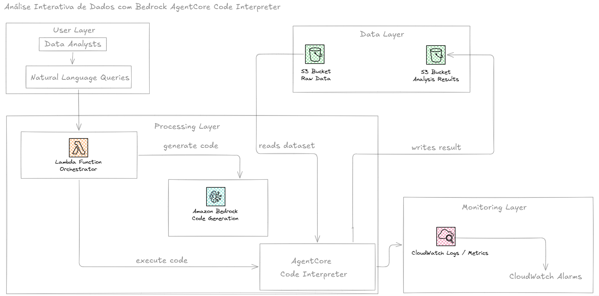

# terraform-aws-bedrock-data-analyst

AI-powered data analysis workflow on AWS using Amazon Bedrock, Amazon Bedrock AgentCore Code Interpreter, AWS Lambda, Amazon S3, CloudWatch, and Terraform.

## Overview

This project implements and validates an AI-powered data analysis architecture on AWS. It combines **Amazon Bedrock** as the code-generation layer, **Amazon Bedrock AgentCore Code Interpreter** as the sandboxed execution environment, **AWS Lambda** as the orchestration layer, **Amazon S3** for data and results storage, and **CloudWatch** for observability.

The entire infrastructure is provisioned as code using **Terraform**, enabling repeatable, auditable, and automated deployments.

## Architecture

The request flow follows this path:

```
User Query → Lambda → Amazon Bedrock (Code Generation) → AgentCore Code Interpreter → S3 (Dataset) → Pandas Analysis → S3 (Results) → Lambda Response
```

Lambda receives a natural-language question and sends it to Amazon Bedrock, which generates Python/Pandas code to answer it. The generated code is executed inside an isolated AgentCore Code Interpreter sandbox, which reads the dataset from S3, applies the business logic, and returns the result. Lambda then stores the result in the results S3 bucket. All activity is logged and monitored through CloudWatch.

### Architecture Diagram



## AI Data Analysis Workflow

The following stages describe how a natural-language question is turned into a result:

- Lambda receives the user's query through an event payload
- Lambda sends the query and dataset information to Amazon Bedrock
- Amazon Bedrock generates Python code using Pandas and boto3
- The generated code is executed inside the AgentCore Code Interpreter sandbox
- The code downloads the dataset from S3, applies the business rules, and calculates the result
- Lambda stores the query, generated code, and execution result in the results S3 bucket

## Business Rules

The generated analysis code follows predefined business rules:

- **Financial Volume** (Volume financeiro, Faturamento, Valor total, Gastos totais) — sum of the `amount` column
- **Fraudulent Transactions** — rows where `is_fraud == 1`
- **Negative Balance** — rows where `balance_after < 0`

These rules provide a consistent interpretation of common natural-language questions.

## Project Structure

```
terraform-aws-bedrock-data-analyst/
├── data/
│   └── sample_sales.csv
├── docs/
│   └── architecture.png
├── infra/
│   ├── agentcore.tf
│   ├── iam.tf
│   ├── lambda.tf
│   ├── main.tf
│   ├── monitoring.tf
│   ├── outputs.tf
│   ├── s3.tf
│   └── variables.tf
├── scripts/
│   ├── deploy.sh
│   ├── destroy.sh
│   └── test.sh
├── src/
│   └── index.py
├── event.json
├── response.json
├── .gitignore
└── README.md
```

## Prerequisites

Before deploying, make sure you have the following installed and configured:

- [Terraform](https://developer.hashicorp.com/terraform/downloads) >= 1.x
- [AWS CLI](https://docs.aws.amazon.com/cli/) configured with valid credentials
- Python 3.x
- Bash shell (Linux/macOS or WSL on Windows)

Configure your AWS credentials before running any script:

```bash
aws configure
```

Make sure the selected AWS account and region support the AWS services and Amazon Bedrock capabilities used by this project.

## Deployment

Deployment is fully automated through the `deploy.sh` script, which provisions the infrastructure with Terraform.

```bash
# Clone the repository
git clone https://github.com/<your-username>/terraform-aws-bedrock-data-analyst.git
cd terraform-aws-bedrock-data-analyst

# Give execution permission to the scripts
chmod +x scripts/*.sh

# Run the deployment
./scripts/deploy.sh
```

The `deploy.sh` script performs the following steps:

1. Verifies Terraform and AWS CLI availability
2. Validates AWS credentials
3. Runs `terraform init`
4. Validates the Terraform configuration
5. Runs `terraform plan`
6. Runs `terraform apply`
7. Displays Terraform outputs

## Security Model

The project follows a separation-of-responsibilities model using dedicated IAM roles.

**Lambda Role** — permissions for CloudWatch logging, Amazon Bedrock model invocation, AgentCore Code Interpreter interaction, reading the raw-data S3 bucket, and writing analysis results to S3.

**Code Interpreter Role** — a dedicated IAM execution role with access to the required S3 resources, allowing the sandbox to read the sample dataset, list the raw-data bucket, and write analysis results when required.

This separation prevents the Code Interpreter from unnecessarily inheriting the Lambda execution role.

## Validation Tests

The project includes an example event:

```json
{
  "query": "Qual é o canal digital que regista o maior volume financeiro em transações fraudulentas?"
}
```

Run the validation:

```bash
./scripts/test.sh
```

The `test.sh` script performs the following steps:

1. Reads the Lambda function name from Terraform outputs
2. Loads `event.json`
3. Invokes the Lambda function
4. Saves the Lambda response to `response.json`
5. Displays the response in the terminal

### Example Analysis Questions

- Qual é o canal digital que regista o maior volume financeiro em transações fraudulentas?
- Qual é o total de transações fraudulentas?
- Qual é o volume financeiro total das transações fraudulentas?
- Qual é a categoria de comerciante com maior volume de fraude?
- Quantas transações apresentam saldo negativo?
- Qual localização apresenta o maior número de transações fraudulentas?

The generated Python code is adapted dynamically to the user's question.

## Validation Evidence

The analysis result produced by a successful run contains the original query, the generated Python code, the execution result, and the S3 location of the result. It is saved locally as `response.json` and stored in the configured S3 results bucket as:

```
s3://<analysis-results-bucket>/analysis-result.json
```

## Terraform Outputs

After deployment, Terraform exposes useful information including:

```
aws_region
raw_data_bucket
raw_data_file
analysis_results_bucket
code_interpreter_id
code_interpreter_arn
lambda_function_name
lambda_log_group
lambda_error_alarm
```

## Cleanup

To remove all infrastructure created by Terraform:

```bash
./scripts/destroy.sh
```

This script requires confirmation before destroying the provisioned resources, preventing accidental deletion.

## Technologies

| Category               | Technology                 |
| ---------------------- | -------------------------- |
| Cloud Provider         | AWS                        |
| Infrastructure as Code | Terraform                  |
| AI / Foundation Model  | Amazon Bedrock             |
| AI Runtime             | Amazon Bedrock AgentCore   |
| Code Execution         | AgentCore Code Interpreter |
| Compute                | AWS Lambda                 |
| Storage                | Amazon S3                  |
| Data Analysis          | Python / Pandas            |
| Observability          | Amazon CloudWatch          |
| IAM                    | AWS IAM                    |
| Automation             | Bash                       |
| Data Format            | CSV / JSON                 |

## Disclaimer

This project was built for educational and portfolio purposes, to demonstrate practical skills in AWS, Generative AI, Amazon Bedrock, AgentCore, serverless architecture, data analysis, and Infrastructure as Code with Terraform. It is not intended for direct use in production environments without further review, hardening, testing, monitoring, cost controls, and adaptation to specific security and compliance requirements.
